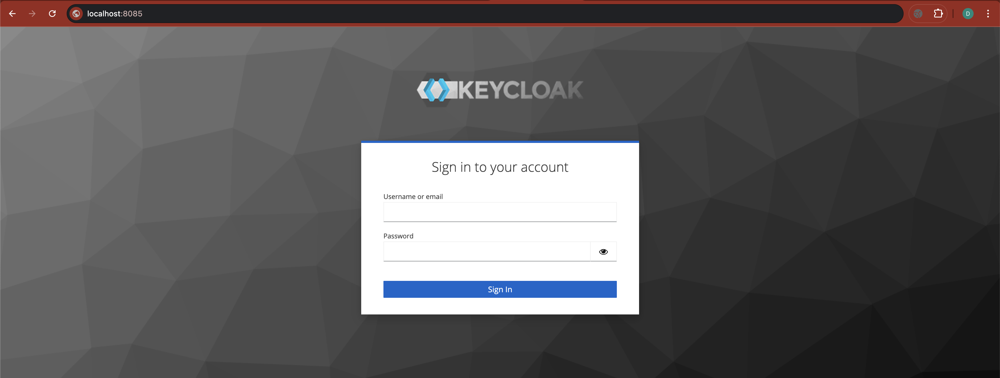
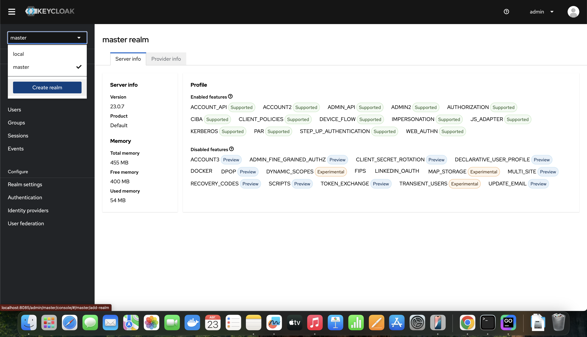
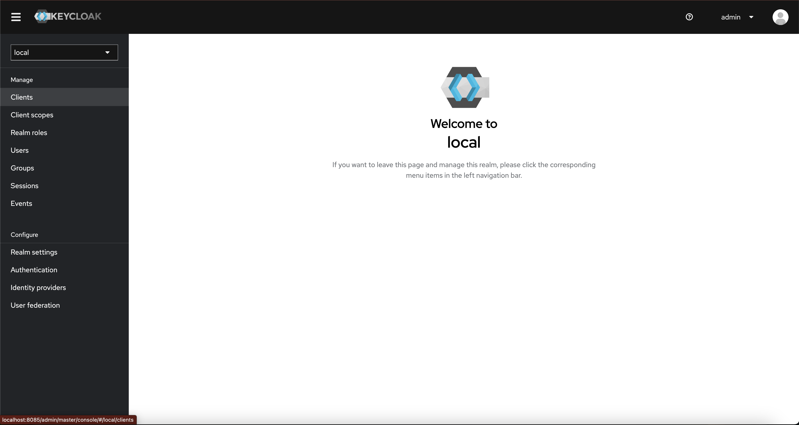
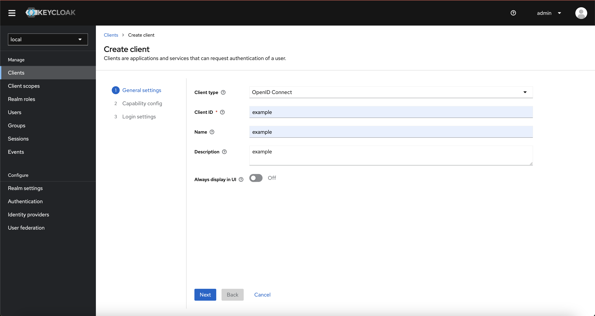
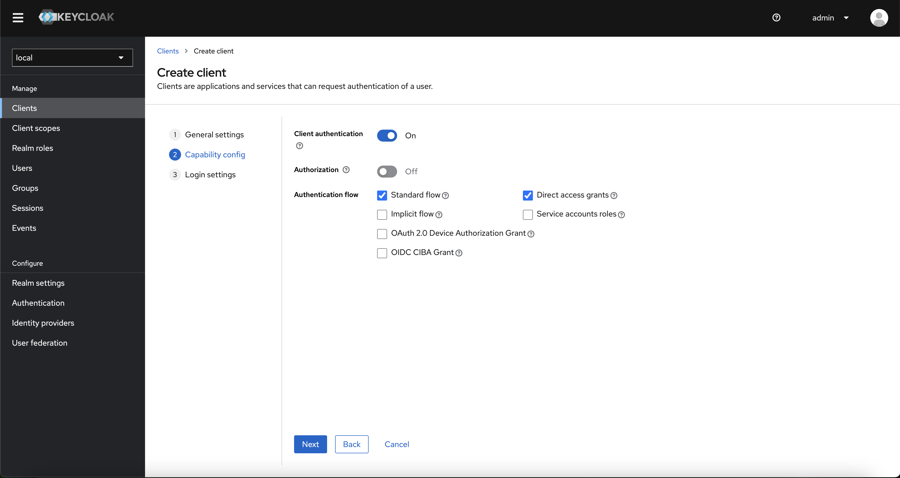
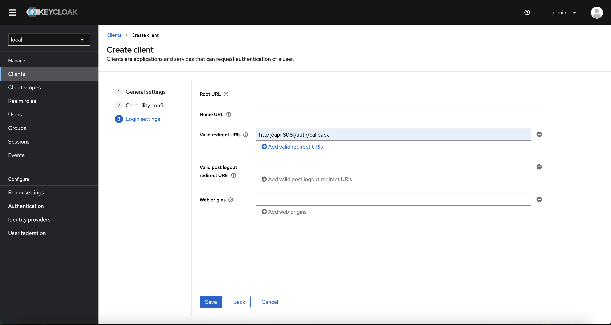
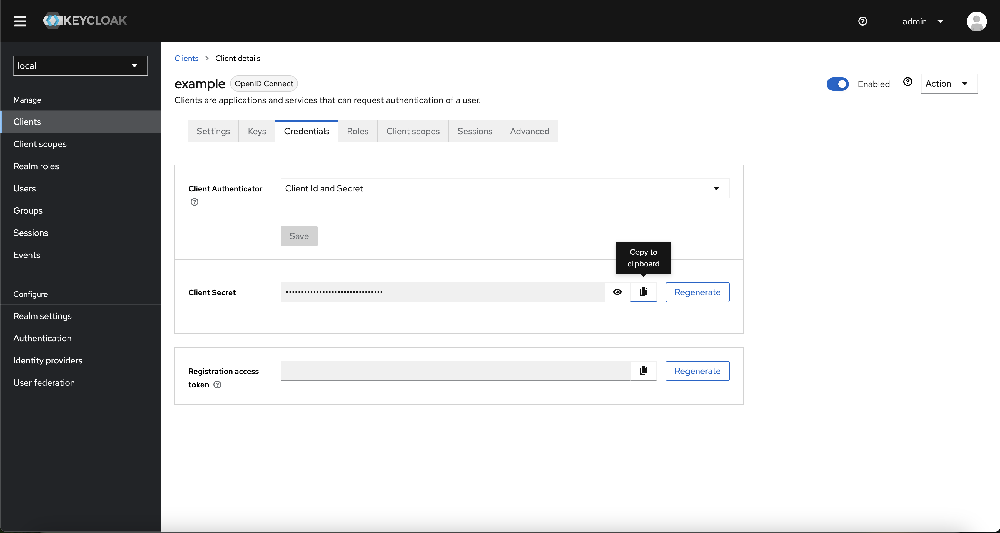

## Запуск dev-среды

Запуск backend осуществляется через **MakeFile** <br>
Перед тем, как запустить скрип, необходимо:
- Заполнить конфигурационный файл **.env-example**
- Переименовать файл **.env-example** в **.env**

##### Код запуска dev-среды (api запускается локально):
```bash
    make create-app
```
Если запуск осуществлялся впервые:

##### Необходимо запустить миграции в БД при помощи команды:
```bash
    make create-migrations
```

Если есть необходимость очистить базу:

##### Необходимо запустить откат миграций БД при помощи команды:
```bash
    make delete-migrations
```

### Если не будет запускать API:
Вероятнее всего, проблема связана с тем, что не было первоначальной настройки **KeyCloak**
### Исправить:
 
1. Зайти на главную страницу KeyCloak
2. Ввести логин/пароль из конфигурации (по умолчанию admin/admin)
  
3. Далее создаем Reaml:

4. После создания Realm, переходим в Clients и создаем нового:

5. Вводим по примеру

6. Вводим по примеру

7. Вставляем ссылку из .env 

8. Копируем Client Secret и вставляем в .env в `AUTH_CLIENT_SECRET`


## Запуск тестирования промптов через Ollama + WebUI

#### Для того, чтобы начать работу по тестированию промптов, необходимо ввести команду

```bash
    make ollama-webui
```

#### Чтобы подгрузить модель в Ollama, необходимо ввести команду:

```bash
    make ollama-pull model={имя модели}
```

##### Примеры:
```bash
  make ollama-pull model=llama2
  make ollama-pull model=llama3
  make ollama-pull model=phi3
```

Актуальные модели можно посмотреть [здесь](https://github.com/ollama/ollama?tab=readme-ov-file#model-library)